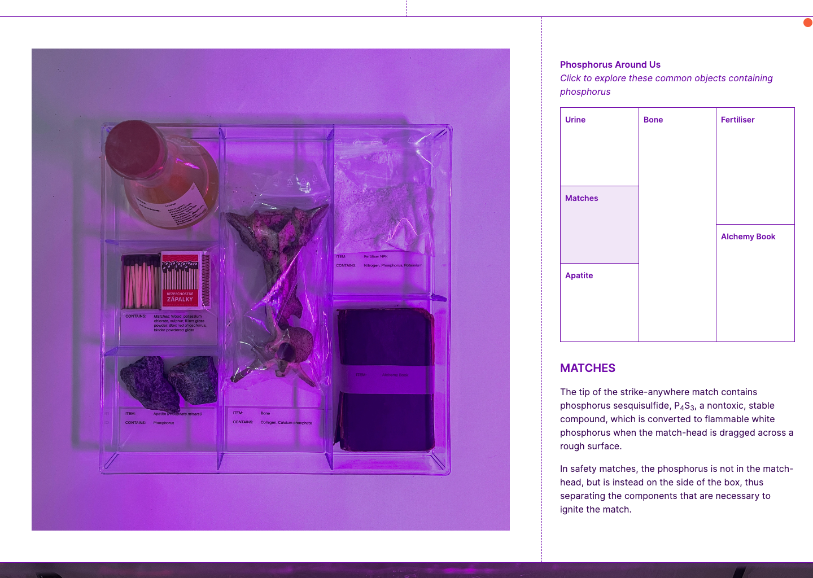
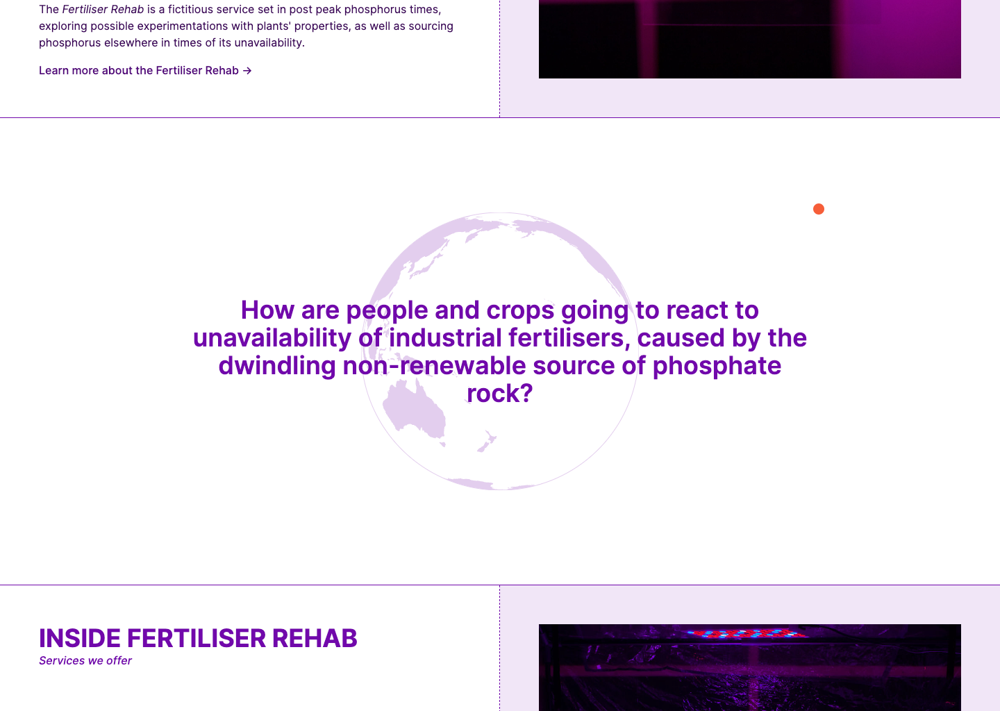
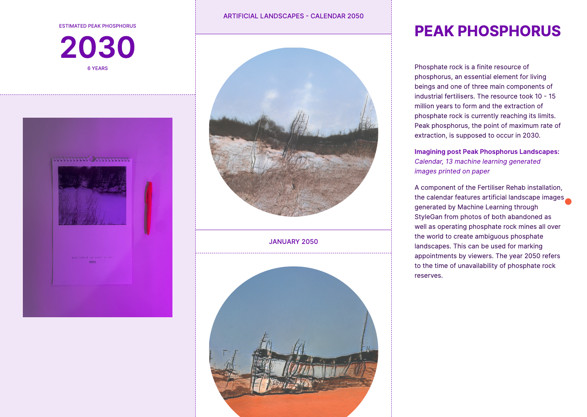

The aim of this website was to incorporate a mixture of storytelling with the idea of this being a fictitious company website. There are elements of scroll storytelling as well as interactive elements to allow you to explore the concept of peak phosphorous, and highlight some of the imagery created for the exhibition.

Below is an example of an interactive grid mimicking the table layout in the exhibition.

The website is built using [Vite](https://vitejs.dev) and [TailwindCSS](https://tailwindcss.com). A spinning globe illustration was built using [D3.js](https://d3js.org).

