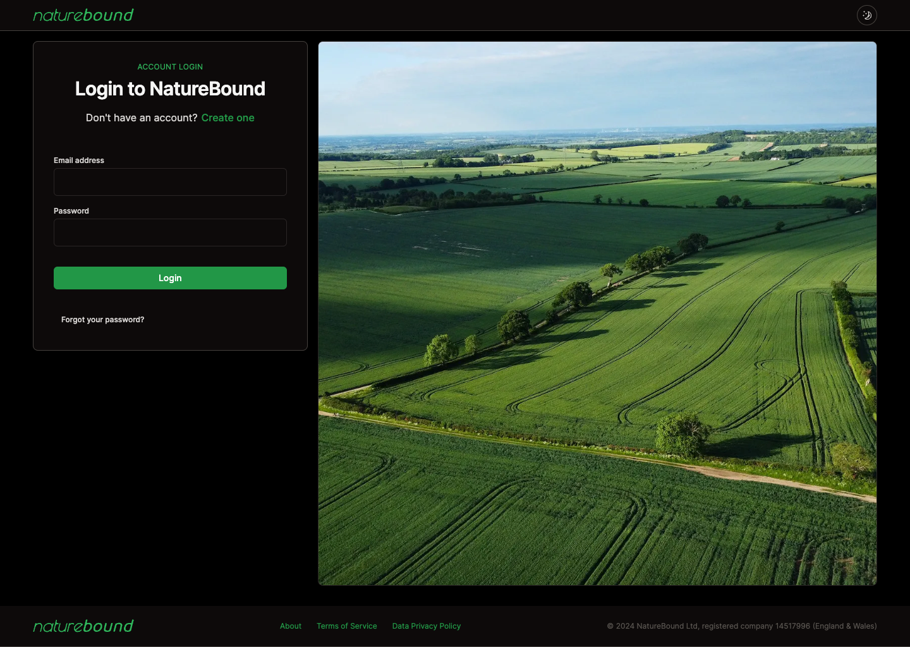

The backend was built internally and hosted on Google Cloud Platform. The front-end was built using [Next.js](https://nextjs.org), [TailwindCSS](https://tailwindcss.com), and [MapLibre](https://maplibre.org) for the map data.

## Server-Side Rendering

Unsure about the consistency and strength of internet connections in rural areas, we opted to use server-side rendering to fetch as much data in one go for the clients, rather than having pages appear piece-by-piece.

We also cache data where possible, to minimise requests between the server and client.

## Dark Mode & Accessibility

As the primary clients are farmers, we wanted to ensure accessiblity standards were met. We utilised large font sizes, high contrasts, and included a dark mode to allow people to choose whatever is most comfortable for them.

