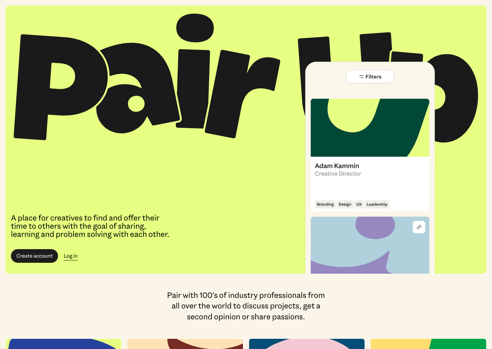

Pair Up was built as a web app, utilising [TailwindCSS](https://tailwindcss.com), [Next.js](https://nextjs.org/), and [Supabase](https://supabase.com) for Authentication and Database. The app primarily consisted of messaging, a public profile, and the ability to broadcast a message to garner feedback and start discussions. In essence, it worked as a small social media platform, with a specific intention.

## Discussion as King

Trying to bring an air of old forum-like discussions in a new platform, Pair Up focused more on credentials and discussion topics rather than building a profile. This allowed people to connect and participate without concern for how they are being percieved.

