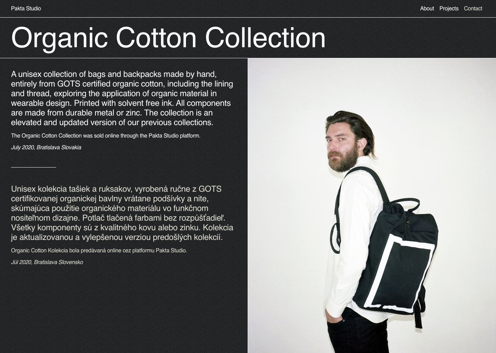
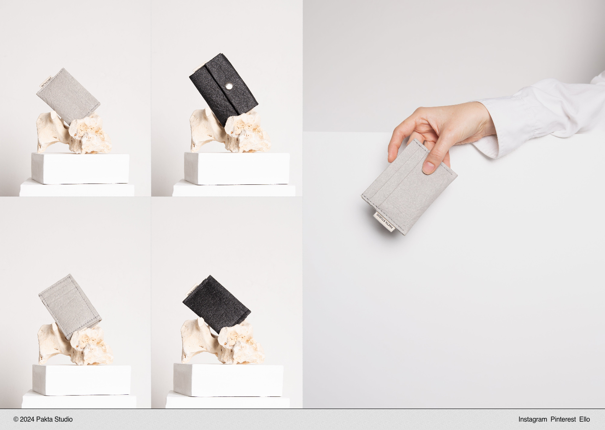

The website was built using [Next.js](https://nextjs.org) and [TailwindCSS](https://tailwindcss.com). As the website was for a personal project which was being archived, I opted to building it statically as any future amendments (if needed) could be easily handled by myself.

## Showcasing Projects

We had a series of different product lines and projects, utilising different materials and visuals. Whilst the website was heavily gridded, taking from the strong rectangular shape of our flagship backpack and logo, we opted to use background colours to distinguish the individual projects.

