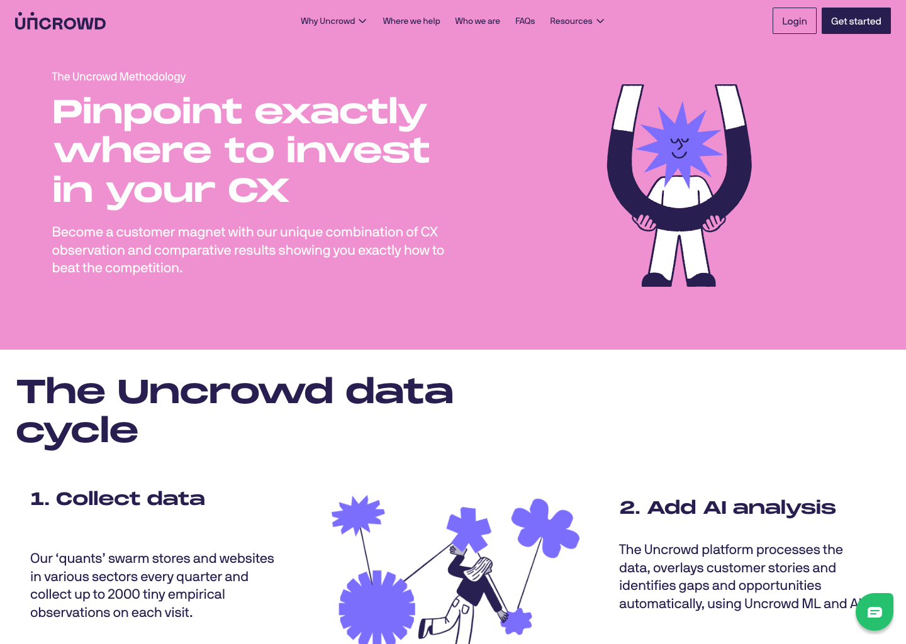
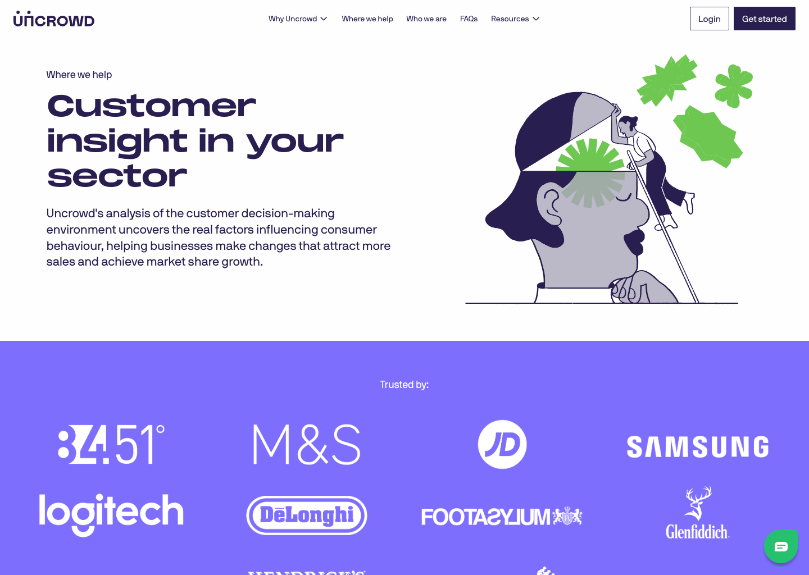

The Uncrowd website was built using [Next.js](https://nextjs.org), [TailwindCSS](https://tailwindcss.com) and a backend CMS built using [Sanity](https://www.sanity.io/). The website is statically generated, with the cache busted when pages are updated in the CMS.

## Modifiable SVG Animations

With an illustrative heavy website, the brand system required a flexibilty to update the colours of various animations. To prevent requiring these to be pre-generated and stored on the website, we utilised SVG animations rendered in React, allowing for the colours to be updated as the branding system is updated, as well as across the website. This provided the team when editing pages in the CMS the ability to pick and choose illustrations and their colours.

## Building Blocks

Rather than building out a website that has prescriptive pages, the whole of the Uncrowd Website is built using a series of modular blocks, allowing them to pick and choose what content is displayed where, and unlimited options for generating more pages.

